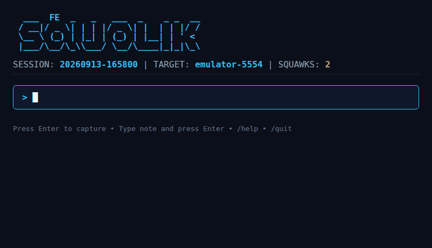
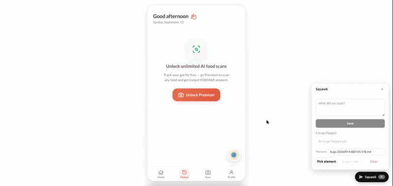

<p align="center">
  <picture>
    <source media="(prefers-color-scheme: dark)" srcset="assets/branding/squawk-logo-dark.svg">
    <source media="(prefers-color-scheme: light)" srcset="assets/branding/squawk-logo-light.svg">
    
  </picture>
</p>

<p align="center">
  <strong>Signal the bug. Export clean context. Hand it straight to your AI coding agent.</strong>
</p>

<p align="center">
  <a href="LICENSE"></a>
  <a href="https://go.dev/"></a>
  
</p>

<p align="center">
  <a href="https://www.producthunt.com/products/squawk-4?embed=true&utm_source=badge-featured&utm_medium=badge&utm_campaign=badge-squawk-4" target="_blank" rel="noopener noreferrer"></a>
</p>

---

## See it in action

<p align="center">
  
  <br>
  <em>The Go CLI capturing a bug in <code>squawk watch</code></em>
</p>

<br>

<p align="center">
  
  <br>
  <em>The web widget picking an element and exporting the report</em>
</p>

---

Squawk is an open-source QA tool for developers doing manual or exploratory
testing. The moment you spot a bug, you "squawk" it: Squawk captures the
context a coding agent needs to fix it — a screenshot, recent device or
browser logs, the exact DOM element you clicked, and your note — then compiles
everything into a single Markdown or JSON report. No manual reconstruction of
reproduction steps.

> **Squawk** is real aviation terminology: the code an aircraft's transponder
> broadcasts to air traffic control to signal its status. Same idea here — you
> squawk the moment you spot a bug, and the tool broadcasts the context for
> someone (or something) else to act on.

## Why Squawk?

When exploratory testing uncovers a bug, capturing the full context is tedious:
screenshots, terminal or browser logs, CSS selectors, and a clear bug report
take minutes per issue. Squawk automates that loop:

- **Instant capture** — record bugs the moment you spot them during testing.
- **Rich telemetry** — Android screenshots + `logcat`, Chrome tab screenshots +
  console logs + uncaught exceptions, and exact DOM element selectors from the
  web widget.
- **AI-ready exports** — structured Markdown/JSON reports formatted for coding
  agents such as Claude, Cursor, Aider, or Copilot.

## Workflow

```text
┌─────────────┐       ┌───────────────┐       ┌─────────────────┐       ┌──────────────────┐
│  Find Bug   │  ──►  │   Squawk It   │  ──►  │ Export Context  │  ──►  │  AI Coding Agent │
│ (App/Web)   │       │ (CLI/Widget)  │       │  (Markdown/JSON)│       │    Fixes Code    │
└─────────────┘       └───────────────┘       └─────────────────┘       └──────────────────┘
```

## Products

Squawk offers two complementary tools:

### 1. Go CLI — Android and Chrome DevTools Protocol

Ideal for testing native Android apps (emulator or physical device) or local
browser apps via Chrome DevTools Protocol.

- **Android backend** — connects via `adb` to capture device screenshots and the
  `logcat` buffer.
- **Browser backend** — attaches to Chrome launched with
  `--remote-debugging-port=9222` and captures tab screenshots, console messages,
  and uncaught exceptions.
- **Interactive TUI** — `squawk watch`, a full-screen terminal UI for rapid
  continuous testing.

### 2. Web Widget — dev-only, zero backend

An embeddable, client-side JavaScript widget for testing web apps directly in
the browser.

- **Zero infrastructure** — no backend, network requests, or account setup;
  flags are stored in `localStorage`.
- **DevTools-style element picker** — locks onto an exact DOM element and
  records its generated CSS selector, tag name, text preview, and screen label.
- **One-click export** — downloads a named or timestamped
  `bugs-YYYYMMDD-HHmmss-<ms>.md` report straight to your downloads folder.

> **Note:** screenshots and system logs come from the Go CLI backends. The web
> widget handles DOM element selection, notes, and Markdown export only.

## Install

### Go CLI

Requires `curl`. Android capture requires `adb` (Android SDK platform-tools) on
your `PATH` and a device or emulator with USB debugging enabled. Browser
capture requires a Chrome instance started with remote debugging. You do not
need both.

**Linux / macOS** (installs to `~/.local/bin`, no sudo):

```bash
curl -fsSL https://raw.githubusercontent.com/DRMCGT/Squawk/main/install.sh | sh
```

Pin a specific version:

```bash
SQUAWK_VERSION=v0.1.0 sh <(curl -fsSL https://raw.githubusercontent.com/DRMCGT/Squawk/main/install.sh)
```

If `~/.local/bin` is not on your `PATH`, the installer prints the line to add
to your shell rc.

**Build from source** (requires Go 1.23+):

```bash
go install github.com/DRMCGT/Squawk/cmd/squawk@latest   # needs $(go env GOPATH)/bin on PATH
# or clone and:
make build      # -> dist/squawk
make install    # -> ~/.local/bin/squawk
```

### Web Widget

The widget is not published to the npm registry yet. Install it straight from
this repository's `widget/` directory with pnpm, which supports installing a
package from a Git subdirectory:

```bash
pnpm add "github:DRMCGT/Squawk#path:widget"
```

The built `dist/` bundles are committed, so there is no build step on your
side. npm and Yarn do not support the `#path:` subdirectory syntax; if you use
them, install the package from a local clone or wait for the registry release.

Import and mount it in development only:

```js
import { mountSquawk } from "squawk-widget";

if (process.env.NODE_ENV === "development") {
  mountSquawk();
}
```

Vite/other `import.meta.env` setups:

```js
import { mountSquawk } from "squawk-widget";

if (import.meta.env?.DEV) {
  mountSquawk();
}
```

No-bundler usage: copy `widget/dist/squawk.js` into your project and load it
with a plain script tag.

```html
<script src="squawk.js"></script>
<script>
  Squawk.mount();
</script>
```

See [`widget/README.md`](widget/README.md) for the full widget API and export
format.

## Quick start

### Android (default)

With your emulator or device running:

```bash
# 1. Start a session (picks the only connected device, or use --device)
squawk init

# 2. Capture bugs interactively — press Enter to capture, type a note then
#    Enter to capture with it, or use slash commands: /capture, /note <text>,
#    /report (refresh the report), /help, /quit
squawk watch

#    Or capture from anywhere (a second terminal works too):
squawk capture --note "save button unresponsive"

# 3. Generate the report
squawk report

# 4. Point your AI coding agent at it
cat .squawk/sessions/<SESSION>/report.md | claude -p "Fix the bugs in this report"
```

### Browser (Chrome on localhost)

Launch Chrome with remote debugging enabled, then start a browser session:

```bash
google-chrome --remote-debugging-port=9222

squawk init --backend browser
squawk devices            # lists open tabs
squawk watch
squawk report
```

Point at a specific tab with `--tab <url-substring>` and a custom DevTools
endpoint with `--cdp http://localhost:9222`. Captures include a screenshot of
the tab plus recent console messages and uncaught exceptions. Same report
format as Android.

## Commands

| Command | Description |
| --- | --- |
| `squawk init` | Start a new session (Android or browser) and make it active |
| `squawk capture` | Capture a squawk: screenshot + recent logs + note |
| `squawk watch` | Full-screen interactive TUI capture loop (falls back to a plain-text loop when piped) with slash commands (`/capture`, `/note <text>`, `/report`, `/help`, `/quit`) |
| `squawk report` | Generate a Markdown or JSON report |
| `squawk devices` | List connected Android devices or open browser tabs |
| `squawk version` | Print version and build metadata |

Common flags:

- `--session-dir` — Squawk data root (default `./.squawk`)
- `--target` — override the session's target (device serial or tab URL)
- `--log-lines` — number of log lines per squawk (default 200)
- `--backend` — `android` (default) or `browser`
- `--cdp` — Chrome DevTools base URL for browser sessions (default `http://localhost:9222`)
- `--tab` — browser tab URL substring to test (with `init --backend browser`)

`capture` accepts the note via `--note` or from stdin when piped:

```bash
echo "save button unresponsive" | squawk capture
```

`report` writes Markdown by default and can emit JSON or a custom path:

```bash
squawk report --format json
squawk report --output /tmp/bugs.md
```

## Sessions and reports

```text
.squawk/
├── current-session            # active session pointer (written by init)
└── sessions/
    └── 20260910-143012/
        ├── session.json       # machine-readable session state
        ├── report.md          # generated by `squawk report`
        ├── report.json
        └── squawks/
            ├── 001/
            │   ├── screenshot.png
            │   └── logcat.txt
            └── 002/
                └── ...
```

The active session pointer lets `capture`, `watch`, and `report` work from any
terminal. Squawks without a note get the fallback title
`Squawk 00N (no note)` in reports. Log excerpts are embedded in
four-backtick Markdown fences so content containing triple backticks can't
break the report.

## Required Libraries

- `github.com/spf13/cobra` — CLI command wiring.
- `golang.org/x/term` — terminal detection (piped vs interactive).
- `github.com/gorilla/websocket` — Chrome DevTools Protocol transport.
- `github.com/charmbracelet/bubbletea` + `github.com/charmbracelet/lipgloss` —
  the full-screen `squawk watch` TUI only. The rest of the CLI stays
  dependency-light plain text.

The web widget has no runtime dependencies; it ships as vanilla JS with Shadow
DOM.

## Design

- **`internal/adb`** — thin wrapper over the `adb` binary (devices, `screencap
  -p`, `logcat -d -t N`). No Android SDK needed.
- **`internal/browser`** — Chrome DevTools backend: open tabs, tab screenshots,
  console + uncaught-exception logs (attaches to a running Chrome).
- **`internal/capture`** — coordinates one capture: screenshot + logs + note,
  persisted as artifacts, recorded in the session. A `Backend` interface
  abstracts Android and browser sources.
- **`internal/session`** — session directories and the `current-session`
  pointer file.
- **`internal/report`** — renders a session to Markdown/JSON. Never calls a
  backend.
- **`internal/cli`** — command wiring and user-facing errors.
- **`widget/`** — standalone, dependency-free web widget package
  (`squawk-widget`).

The capture logic is decoupled from output formatting so a future hosted layer
(sync, team accounts, GitHub/MCP integration) can consume the same session
data.

## Testing

```bash
# Go CLI
go test ./...

# Web widget
cd widget && npm run check
```

CLI tests use an injectable adb runner plus a fake `adb` script in
`testdata/fake-adb` — no emulator required. Set `SQUAWK_ADB` to point at a
custom adb if needed. Widget tests use vitest + jsdom and include a bundle-size
gate.

## Release builds

Build with embedded version metadata:

```bash
make release        # builds tarballs + SHA256SUMS.txt into dist/
```

Version, commit, and build date are injected at compile time via `-ldflags`
and reported by `squawk version`. Tagging a `v*` version pushes release assets
(Linux/macOS × amd64/arm64) automatically via GitHub Actions.

## Branding

Logo assets, the color system, and usage guidance live in
[`assets/branding/BRAND.md`](assets/branding/BRAND.md).

## License

[MIT](LICENSE)